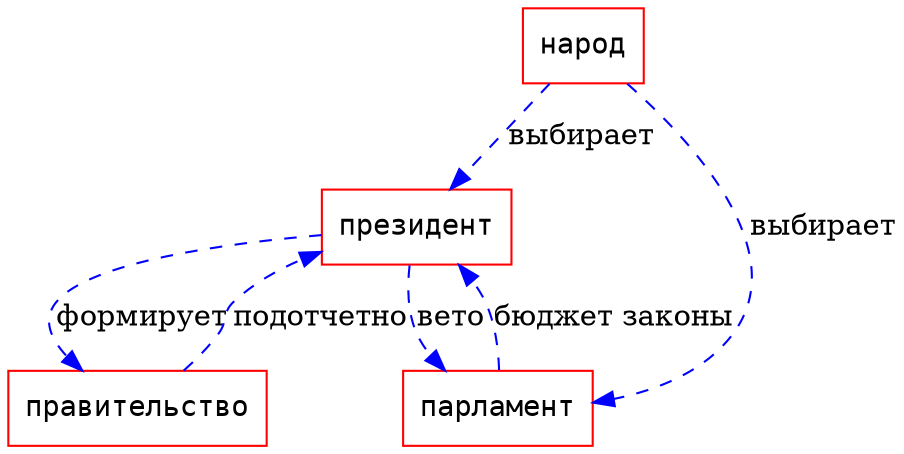
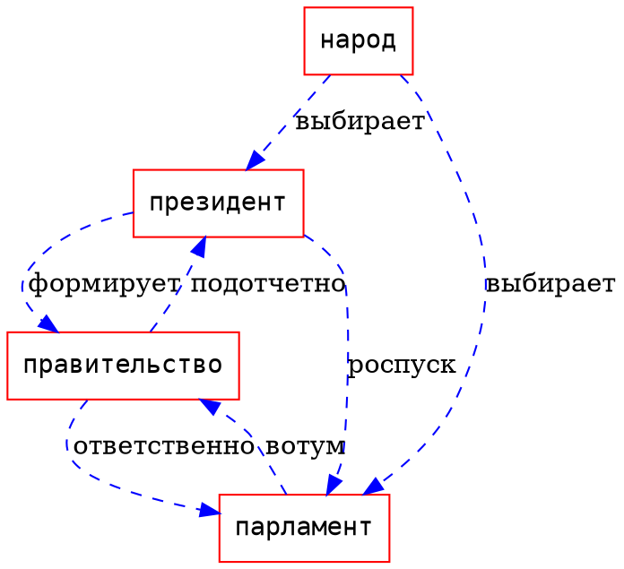

# Введение

ИМ состоит из двух дисциплин

- политология
- основы идеологии белорусского государства

Актуальность изучения ИМ Политология обусловлено тем, что политология -- наука о политике. C древних времён политика выделяется как одна из важнейших сфер деятельности, которая влияет на наше жизнь.  Политика неразрывно связана с идеологии и без идеологии существовать не может.

Литература:

- Конституция РБ (15 марта 1994 года)
- Политология: пособие для студентов учреждений высшего образования / Решетников


# Теория политики, история и методология политической науки

## Политология как отрасль научного знания и учебная дисциплина. Объект и предмет политической науки. Структура, методы и функции политической науки.


**Политология** --  учение, наука о политике.

**Объектом** политологии является политическая действительность (или политическая сфера жизни общества -- политическое сообщество) и её различные элементы и отношения. 

**Предмет** политологии рассматривается в узком и широком смысле. В узком смысле -- только политическая власть. В широком -- предметом политологии является всё политическое. 

Политология с точки зрения широкого смыла как комплексная интегративая наука включает в себя следующие дисциплины: 

- политическая философия
- политическая история
- политическая социология
- политическая психология
- политическая антропология
- политическая география
- политическая коммуникативистика
- политическая экономия
- и т. д. 

В современной отечественной и зарубежной политической науке наблюдается движение по направлению к широкому пониманию предмета политологии: 

1. субъекты политики, политические лидеры и элиты
2. механизмы функционирования власти
3. политические институты
4. политическое сознание, культура, идеология

Политология развивается как целостная система *эмпирического* (направлена на сбор фактической информации о политических явлениях), *теоретического*, *прикладного* знания.

**Методология политической науки** -- это учение о применении различных методов политического познания. 
Профессор Дегтярёв выделяет 3 группы методов: 

- общенаучные
- социально-унитарные (институциональный метод, исторический, социологический, сравнительный, психологический)
- специально-научные методы (SWOT анализ, ситуационный анализ, event-анализ, ресурсный, позиционный методы, метод экспертных оценок, метод сценариев, case-studies). 

```
[задание: спец метод]
```

Функции политологии:

- гносеологическая (или познавательная, аналитическая)
- прогностическая
- методологическая
- инструментальная (или регуляционная)
- идейно-воспитательная
- сравнительная

## История политической мысли и стадии институционализации политической науки РБ и за рубежом

### Морис Дюверже

Французский политолог Морис Дюверже выделил 4 этапа в становлении институционализации политической науки: 

1. этап: предыстория политической науки,	 с древности до 19 века
    - мыслитель древности и античности (представители: Платон, Конфуций, Цицерон, Аристотель)
    - мыслители средневековья(Аквинский, Августин Блаженный)
    - мыслители эпохи возрождения и реформации(Макиавелли, )
    - мыслители начального периода нового времени(Томас Гоббс, Джон Локк, Монтескьё, Жан-Жак Руссо)
2. этап: Карл Маркс, Алексис де Токвиль, Джон Стюарт Милль
3. этап: история полит науки

1 и 2 этап характерны универсальным подходом в изучении политики, то есть ... Значения этих подходов связаны с передачей знаний из поколения в поколение. 

### Роже-Жерар Шварценберг

Французский политолог Роже Шварценберг полагает, что зачатки политической науки в институциональном смысле были заложены выдающимся итальянским математиком Макиавелли.
	
Заслуги Макиовелли (выделил понятие власть в качестве объекта познания, один из первых начал ..., освободил полит исследования от религиозно-этической формы, подчинив решению реальных прикладных задач).


### Политическая мысль древности

С 2 и 1 тысячелетия до н. р. до нас дошли памятники законотворчества, первые памятники законотворчества, первые письменные источники политической мысли: компиляция свода норм рабовладельчества 

### Тезисы античности


- отделение знаний о политике от мифологической формы и обособление как 
- обособление знаний о политике как самостоятельной части философии
- анализ проблем политики через призму достижения справедливости, добра, общего блага
- осмысление сущности и происхождения государства, классификация ...

### Тезисы средневековья
    
- развитие политической мысли в рамках христианского, религиозного мировоззрения и богословия
- разработка теологической концепции политической власти
- обоснование приоритета церкви над государством в политике
- возникновение идеи об отделении духовной власти от мировой

### Эпоха Возрождения в реформации


- освобождение политического знания от теологии
- исследование сферы политики с рационально-критический  позиций в контексте принципа реализма
- становление гражданской концепции политики

### Новое время (XVI-XIX)
    
- разработка концепции общественного договора, обоснование идеи естественно-правового равенства людей, верховенства закона, разделения властей, конституционного правления, гражданского общества, народовластия
- формирование концепции прав человека и гражданина
- становление социальной концепции политики
- формирование идеологий -- либерализма, консерватизма, социализма
- обоснование материалистического понимания государства, политики, права, истории

Первая кафедра политологии -- Нью-Йорк 1857 г.

Политология как самостоятельная наука и учебная дисциплина в современном её понимании сложилась в середине XIX - начале XX вв. 

### Этапы развития современной политической науки

**I этап (конец XIX - 40-у XX века)**

Развитие политической науки на рубеже веков связано с именами М. Вебера, Г. Моска, В. Парето, Р. Михельса, М. Острогородского, Э. Дюркгейма. 

Цель этой революции сделать ценностно-нейтральной и получить объективные беспристрастные знания о политике путём использования строго научных методов.

**II этап (конец 40-ч гг. - до второй половины 70-ч гг. XX в)** Ознаменовался поведенческой революцией.

**III этап. (Постбихевиоралистский) (Середина 1970 гг - ....)** Период развития, характеризуется поиском новых парадигм развития политологии. 


## Современный период

С. Решетников, В. Божанов, В. Н. Ватыль, В. А. Мельник, Л.Е. Криштапович, Я. С. Яскевич


## Этапы развития современной политической науки в РБ

### Первый этап: (1991- 1994)

Соответствует периоду парламентской республики. Появление первой кафедры политологии БГУ в 1991.

### Второй этап (1994 - 1996) 

Приходится на период президентской республики. Первые президентские и парламентские выборы продемонстрировали спрос на прикладные политические исследования и разработки политических технологий. 

### Третий этап (1996 - 2001) 

Связан с процессом политической стабилизации. В результате конституционного референдума 1996 г. белорусская политическая система приобрела новые черта. Внимание политологов было обращено к проблемам общей теории и национальных моделей демократии  к исследованию местных элит, проблемам общественного сознания и идеологий, СМК , политический режимов. Появились институты полит исследований.

#### Четвёртый этап

 Ознаменовался переходом отечественной политологии с к проблемам практической политики и гос управления. 

### Государственные информационно-аналитический центры

- ИСПИ
- БИСИ
- МНИИСЭП

### Негосударственные информационно-аналитические центры

- НИСЭПИ
- econoom.org 
- liberty-belarus.org
- e-belarus.org


## Политика как сфера общественного и гос управления. формальное, содержательное и процессуальные измерения политики. Функции и типология политики.

Политика -- государственные или общественные дала и введен в оборот в середине 1 тыс до н. э. Аристотелем.
	
## Подходы к пониманию сущности политики: 

### Субстанциальный (сущностный) 

Подход ориентирован на раскрытие первоосновы внутренней сущности политики: субстанциональный, институциональные, конфликтно-консенсусное, антропологические определения. 

1. Макс Вебер: Политика означает стремление к участию во власти или оказанию влияния на распределение власти, будь то между государствами, будь то внутри государства между группами людей, которых оно в себя заключает.

2. Ленин: Политика -- это участие в делах государства, определение форм, задач и содержания его деятельности. 

3. Политика -- это деятельность по насильственному или мирному разрешения конфликтов. Политика как искусство нахождения согласия.

4. Аристотель политика -- наука, знание о том, как наилучшим образом организовать совместную деятельность.

### Социологический подход 

Основан на характеристике политики через другие общественные явления: экономику, право, мораль, культуру

1. экономические определения
2. правовые определения(Спиноза, Гобс, Лок)
3. нормативно-этнические, ценностные определения (Платон, Аристотель)
4. культурологические(Шелтер, Арендт)

### Системный подход
С системной точки зрения политика является самостоятельной подсистемой социума, имеющей центр принятия решений и окружение, связанные механизмами обратной связи (Парсонс, Истон, Алмоно)


```
[задание: своё определение политики]
```


Измерения политики: 

- Формальное - политическая организация общества, политический порядок, как совокупность политических институтов, политических традиций, правовых норм
- Содержательное содержание политики, политический курс
- Процессуальное - полит процесс, осуществление поведение политики

Структура политики: 

- политическое сознание
- политическая организация
- политические отношения

Свойства политики: 

- универсальность
- темпоральность
- конкурентность
- асимметричность
- инклюзивность
- пространственность

Функции политики:

- выражение и реализация властно значимых интересов групп и слоев общества
- предотвращение и регулирование групповых конфликтов
- распределение и перераспределение общественных благ с учётом групповых приоритетов для жизнедеятельности общества в целом
- управление и руководство общественными процессами
- интеграция общества и обеспечение целостности общественных систем
- социализация личности
- обеспечение коммуникации

Типология 

- по сферам жизнедеятельности общества
- что-то ещё


## Власть 

**Власть** -- возможность осуществить свою волю вопреки сопротивлению других (М. Вебер.)

Концепции власти: 

- реляционная
- поведенческая
- системная
- структурно-функциональная
- коммуникативная
- натуралистическая
- марксистская.

Структура властных отношений:

- субъект и объект власти
- приказ
- подчинение
- нормы и правила
- источники, основания и ресурсы власти 


Источники, основания и ресурсы власти -- объект и субъект условия, которые являются причинами социального неравенства. Задействованные источники власти превращаются в основания власти, как совокупность факторов, позволяющий подчинить к власти.

Источники власти (по Э. Тоффлер "Метаморфозы власти")

- сила
- богатство
- знания

**Ресурсы власти** - любые реальные потенциальные средства, которые можно использовать для воздействия на объект. Ресурсом может быть всё: личностные, материально-экономические, культурно-информационные, социально-политические, административно-правовые, административно-силовые.

Механизм реализации власти:

- господство
- руководство
- организация
- управление
- контроль

Типы власти:

- по ресурсам
- по субъектам
- по функциям органов власти
- по степени институационализации и типу организации

Соотношение политической и государственной власти:

- политическая власть
	- государственная
	- общественная

**Государственная власть** - высшая форма проявления власти.  

Общественная власть формируется специальными общественными институтами. Решения, принятые общественной властью носят локальный характер.

По функциям:

Формы власти:

- сила
- принуждение
- побуждение
- убеждение
- манипуляция
- авторитет

**Легитимность политической власти** -- (начало XIX во власти) это социально-политическое и психологическое явление, когда устанавливается общественное согласие на определённую власть; это признание обществом правомерности власти и её права управлять.

Типы легитимности господства по М. Веберу

- традиционная легитимность
- харизматическая легитимность
- рационально-легальная легитимность

Типы легитимности по Д. Истону:

- идеологическая
- структурная
- персональная

## Политическая система

Системный подход в науке получил распространение в 40-е гг.
Значительное влияние на развитие теории систем оказала кибернетика.

Первую модель социальной системы представил американский социолог...

Термин "политическая система" стал широко использоваться в политологических исследованиях в послевоенный период.
Модель политической системы впервые разработал Дэвид Истон в 50-е гг.

Подходы к анализу полит системы:

- институциональный
- системный

**Институциональный** -- политическая система как совокупность государственных институтов(государство, политические партии, СМИ, избирательная система) и норм, посредством которых реализуются политико-властные отношения.

**Системный** - политическая система как система социальных взаимодействий, направленных на целедостижение, интеграцию и адаптацию внутри общества посредством реализации власти.

Политическая система по Истону -- совокупность взаимодействий посредством которых ценности привносятся в общество и в нем распределяются. Истон предполагает рассматривать полит систему как чёрный ящик, его интересуют только внешние реакции. 


В рамках системного подхода политическая система имеет границы со средой (вход, выход). Вход - любое событие, которое по отношению к системе, влияет на неё и может её изменить. На вход в полит систему поступают *импульсы*:

- **требования** (мнения общества относительно справедливости общественного курса), требования направляются в адрес властей и служат сигналом, что в обществе есть проблемы(потребности)
- **поддержка** (выражение лояльности или легитимация полит системы). Виды поддержки: открытая (акции),скрытая. Уровни поддержки: поддержка всего общества, поддержка режима, поддержка органами власти
- **выход** -- ответная реакция полит системы на взаимодействие со средой переработанная политической системой в решения и действия.(нормативно-правовые акты и др.)

Вход и выход постоянно взаимодействуют друг с другом через окружающую среду. Решения и действия оказывают влияние на среду, в результате возникает на входе появляется новое действие и поддержка, этот процесс называется *петлёй обратной связи*.

## Структура

Структура полит системы:

- **институциональная** ( гос-во, полит партии, СМИ, избирательная система)
- **нормативно-регулятивная** - совокупность норм, регулирующая отношения(конституция, традиции, нормы морали)
- **функциональная** (полит процесс, полит режим)
- **коммуникативная** (различные формы взаимодействия(формальные и неформальные))
- **политико-культурная** (менталитет).

Г. Алмонд "Политика развивающихся регионов" (1969):

## Функции

Функции политической системы:

1. преодоление социально-значимых целей развития общества
2. мобилизация ресурсов на достижение поставленных целей
3. управление политическими процессами
4. контроль за выполнением законов и правил, пресечение действий, направленных на из нарушение.

Функции системы в целом:

- рекрутирование
- социализация
- коммуникация.

Функции процесса

- **"на входе"** -- артикуляция интересов и агрегирования интересов
- **"на выходе"** -- определение политического курса, осуществление полит курса, вынесение судебных решений.

Функции  политического курса или функции конкретный политики:

- экстрактивная
- дистрибутивная
- регулятивная
- реагирующая
- символическая. 


## Классификация политических систем

- по характеру взаимодействия с внешней средой
    - открытые
    - закрытые
- по типу легитимного господства
    - традиционные
    - харизматические
    - рационально-легитимные
- по типам политических режимов
    - тоталитарные
    - авторитарные
    - демократические

- по территориально-пространственному критерию
    - островные 
    - континентальные

- по историческому типу общества:
    - рабовладельческие
    - феодальные
    - буржуазные

**Политический режим** -- это совокупность способов, методов, средств, с помощью которых осуществляется власть в государстве.

 

# Политические институты в Республике Беларусь и современном мире

Вопросы: 

- Политические  институты как организационная структура системы политических отношений. Государство как основной институт полит системы общества. Подходы к исследованию сущности и происхождения государства. Понятие "форма государства" и его составляющие. Гражданские правовые основы современного государства.

**Политический институт** -- это установленные учреждения и правила, регулирующие определённую область политических отношений; это выражение формализации и деперсонализации политики(государство, президентство, СМИ и т. п.)

Теория происхождения государства:

- натуралистическая
- теологическая
- патриархальная
- договорная
- теория насилия
- ирригационная
- психологическая
- органическая
- марксистская

**Государство** -- основной институт полит системы, организация, образованная социальной общностью на определённой территории, обладающая верховной властью и монопольным правом на применение легитимного принуждения.

В широком понимании государство -- это и граждане, и аппарат государственного управления. У узком смысле -- это аппарат управления. 

Государство:

- население
- территория
- признаки государства
    - суверенитет 
    - монопольное право на издание законов
    - монопольное право на применение легитимного принуждения
    - монопольное право на взимание налогов и сборов.

## Функции государства:

**Внутренние функции**: охранительная, экономическая, социальная, экологическая, регулятивная, культурно-воспитательная

**Внешние функции**: взаимодействие с другими государствами, защита от внешней угрозы, участие в решении глобальных проблем современности.

## Государственный механизм

**Государственный механизм**: глава государства, представительные органы государственной власти, исполнительно-распорядительные органы, органы судебной власти, органы прокуратуры, органы государственного контроля, органы охраны общественного порядка, органы государственной безопасности, вооружённые силы, государственные СМИ.

Форма государства:
- форма государственного устройства
    - унитарное государство
    - федеративное государство
    - конфедерация
- форма правления
    - монархия
        - абсолютная
        - выборная
        - теократическая
        - конституциональная
    - республика
        - президентская
        - парламентская
        - смешанная
- политический режим
    - демократия
    - авторитаризм
    - тоталитаризм

Парламентская республика:


Парламент формирует правительство(исполнительная власть), правительство несёт ответственность перед парламентом. Президент, как правило, избирается парламентом и не обладает большой властью (символизирует единство власти, церемониальный руководитель). Главную роль влияет глава правительства. Правительство формирует партия, которая победила на выборах, а её лидер становится главой правительства. 






**Президентская республика** -- форма правления, когда президент  -- глава правительства и исполнительной власти. Президент и парламент избираются народным голосованием. Парламент (законодательная власть) и президент ( исполнит власть) обладают значит самостоятельностью.  Парламент может воздействовать на президента через бюджет и законы. Президент -- через право отлагательного вето. В классической президентской республике президент не может распустить парламент, а парламент не может выразить недоверие к правительству. Процедура импичмента возможна. 

Сильная президентская власть сочетается с двойной ответственностью: президента и парламента. Президент формирует правительство, президент руководит правительством, с учётом расстановки сил в парламенте. Из представителей партии, которая победила на выборах. Президент и парламент избираются народом. Парламент может вынести правительству недоверие, а президент может распустить парламент и назначить досрочные выборы. 


Конституция РБ определяет в 1 статье как демократическая(3, 4, 6, ...), социальная(41-51), правовое гос-во(2,6,7, 22). 

**Правовое государство** -- это государство, ограниченное в своих действиях правом, защищающим свободу личности, и подчиняющим власть воле народа. 

Признаки правового государства:

- верховенство права
- правовое равенство
- признание и неотчуждаемость прав и свобод человека
- взаимная ответственность государства и личности
- наличие эффективных форм контроля соблюдения прав

**Социальное государство** -- государство, которое стремится к социальной и экономической справедливости общества, обеспечиванию достойного существованию, обеспечению прав и свобод, примерно равных возможностей их реализации. Социальное государство проводит активную социальную политику. 

Правовое и  социальное государство не может функционировать без гражданского общества.

**Гражданское общество** -- система самостоятельных и независимых институтов и отношений, которые призваны содействовать самореализации отдельных групп. 

Институты: семья, церковь, политическая партия.

## Институт главы государства

1. монарх
2. президент
3. глава государства в виде коллегиального  органа, избираемого  парламентом на определённый срок
4. глава государства по совместительству
5. глава государства условно является генерал-губернатор -- представитель британского монарха в государствах бывших колониях
5. узурпация власти

Полномочия главы государства 

1. представительские функции
2. полномочия в области государственного управления
3. полномочия, связанные с деятельностью парламента и в законодательной сфере
4. полномочия в военной сфере
5. полномочия в сфере личного статуса
6. чрезвычайные полномочия
7. полномочия в области правосудия

Законодательная власть

**Парламент** -- общегосударственный высший выборный законодательный и представительный орган страны, осуществляющий представительство интересов различных социальных групп населения. 


Виды парламента:

- однопалатные 
- двухпалатные

Функции парламента:

- властная
- представительная
- законодательная
- контрольная 

## Исполнительная власть

Особенности исполнительной власти:

1. подзаконность органов исполнительной власти
2. универсальность
3. представительный характер

**Правительство** -- это центральный коллегиальный орган исполнительной и распорядительной власти, возглавляющий государственную администрацию и осуществляющий непосредственное управление государством, руководство его внутренней и внешней политикой.

Виды правительства:

- однопартийная
- многопартийные коалиционные
- беспартийные
- правительство большинства
- правительство меньшинства
- правительство национального согласия

## Институты гос власти в РБ

Правовой основой полит системы является конституция (пятая в РБ) -- основный закон государства, закрепляющий организацию власти и определяющий принципы её взаимоотношения власти. 

**Президент** -- должность была введена 1996 в результате выборов. Статус и функция закреплены(гл. 3 конституции, закон "о президенте" №362")


Основные функции Президента РБ:

1. гарантийная функция
2. арбитражно-интегративная
3. контрольная функция
4. нормотворческая (издание директив и декретов, указов)

Этапы развития парламента в Беларуси(посмотреть на сайте):

1. советский
2. постсоветский

Согласно первой редакции конституции, высшим представительным  органом был совет министров. После референдума 1996 название, полномочия парламента изменились. В настоящее время парламент -- "национальное собрание", 2 палаты. Конституция определяет парламент как высший представительный законодательный орган власти. 

## Органы исполнительной власти.

Общей для них является ... Исполнительной и( они исполняют или реализуют решения вышестоящей власти)
Распорядительные акты
Правительство (совет министров) центральный орган гос управления (глава 5 Конституции). Закон РБ по совету министров №424

Классификация органов исполнительной власти:

- республиканские органы: министерства, ...
- местные органы(исполкомы)

По характеру полномочий:

- органы общих компетенцией
- органы специальных компетенцией (гос комитеты)

По форме осуществления своих полномочий:
- коллегиальные(решения применяются большинством голосов)
- единоначальные(напр.от имени министра)

Правительство состоит из премьер-министра, его замов и министров. В состав правительства могут входить..
Правительству подчиняются сети ведомств, функционирующие во всех сферах жизнедеятельности (5 май, 1996 №209)

## Судебная система

Судебная власть принадлежит судам. 

Система судов:

- конституционный суд
- система судов общей юрисдикции, верховный суд, областные суды, экономический суды, районные суды

Органы местного управления и самоуправления
Органы местного управления организована через органы, которые являются вышестоящими. Самоуправления - деятельность населения.


# Политические процессы в РБ и современном мире

## Политический процесс

**Политический процесс** -- это способ функционирования политически организованного общества, связанный с учреждением, осуществлением, эволюцией, изменением природы публичной власти. Т. е. взаимодействие субъектов политики на центральном и региональном уровнях, законодательных, исполнительных, суд, органов и административных служб.

Структура политического процесса:
 
- субъекты
- объекты
- средства, методы, ресурсы исполнители процесса


Режимы существования политического процесса:

- режим функционирования
- режим развития
- режим упадка

Типология полит процесса:

|Классификационных критерий | Типы политического процесса|
|---------------------------|----------------------------|
|По объектам полит воздействия | внешнеполитические и внутриполитические процессы|
|По значимости для общества тех или иных форм политического регулирования социальных отношений | базовые и периферийные процессы |
|По предлагаемым способам реализации сформированных идеалов, ценностей, целей | революционных и эволюционный процессы|
|С точки зрения публичности осуществления правящими кругами своих властных полномочий, принятия решений | открытый и скрытый |
|С точки зрения устойчивости политической системы | стабильные и нестабильные политические процессы


Концепции политического цикла:

1. формирование и формулирование политических проблем
2. построение политической повестки дня (совокупность актуальных общественных пробем, порождающих требования общества, которые власти принимают в расчёт и принимают действия)
3. принятие политических решений
4. реализация полит решений
5. оценка исполнения и эффективности принятых политических решений

Политический процесс состоит из действий. **Политическое действие** -- вмешательство одного человека или группы в отношении власти данной системы в целях своих интересов. 

Виды политических действий:

- По содержанию: 
    - позитивное
    - негативное(абстенционизм)
- По типу общественных преобразований, по отношению политических сил к действительности:
    - революции
    - контрреформация, мятеж, бунты, крестьянские войны
    - реформы
    - политические перевороты
    - популизм


## Общественные объединения, типология с сравнительный анализ партийных систем. Политический партии в РБ.

Право на свободу объединений -- ст. 36 конституции РБ


**Общественное объединение** -- добровольное формирование, возникшее в результате свободного объединения граждан. Понятие общественного объединения: политические партии, общественные организации, общественные движения.


**Общественная организация** -- добровольное объединение граждан на основе общности интересов, имеющее относительное устойчивую организационную структуру, фиксированное  индивидуальное или коллективное членство.

Общественное движение отличаются массовостью, широкой социальной базой, организационной и идейной аморфностью, нередко стихийностью и спонтанностью действий, слабой организованностью

Деления общественных организаций во многом условно, так как часто по мере возникновения...

Функции общественных объедений:

1. выявление общественных интересов
2. социальная интеграция, мобилизация
3. социализация
4. представительство и защита интересов

В настоящее время деятельность общественных объединений регулируется законом РБ от 4 дек 1994 3254 "Об общественных объединениях", законом 5 окт 1994 3266 "О политических партиях". По состоянию на июль 2019 в РБ зарегистрированы 15 партий, 28 профсоюзов(самый крупный ФПБ), 2907 объединений, 7 республиканских государственных общественных объединений.

По направлению деятельности общественные объединения:

- физкультурно-спортивные
- благотворительные
- молодежные
- просветительские, культурно-досуговые, воспитательские
- объединения, относящие себя к национальным меньшинствам
- ветераны..
- научно-технические
- объединения сторонников охраны природы, памятников культуры
- женские

Государственно-общественные объединения(7): 

- ДОСААФ, 
- ОСВОД, 
- БОР, 
- БДПО,
- ПСК, 
- БОЗ

Генезис партий по Веберу:

- Аристократическая группировка
- Политический клуб 
- Массовая партия

Причины появления массовых партий:

1. Расширение избирательного корпуса
2. Развитие и сплочение рабочего класса
3. Партии как ненасильственный способ разрешения конфликтов

**Политическая партия** -- добровольное общественное объединение, преследующее политические цели, содействующее выявлению и выражению политической воли граждан и участвующее в выборах 

Активисты и функционеры $\subseteq$ Члены партии $\subseteq$ Симпатизирующие $\subseteq$ Электорат

Роберт Михельс ("Политический партии")
Остроградский Моисей Яковлевич("Демократия..")
Морис Дюверже("Политические партии")

Признаки политических партий:

1. идеологический
2. организационный
3. социально-классовый
4. функциональный

Функции партий:

1. представительство интересов
2. выработка политической линии
3. формирование общественного мнения
4. политическое рекрутирование
5. участие в борьбе за власть

Типология партий по Дюверже:

- Кадровая партия: много электората
- Массовая партия: много членов партии

Партийные системы, уклады, коалиции:

- конкурентные:
    - многопартийные:
        - классическая многопартийная система:
            - конъюнктурные коалиции
            - электоральные коалиции
            - легислатурные коалиции
        - блоковая
        - многопартийная система с доминирующей партией
    - двухпартийные:
        - классический двухпартийный уклад
        - уклад "двух с половиной партий" или две + одна партий
- неконкурентные:
    - однопартийные
    - беспартийные
